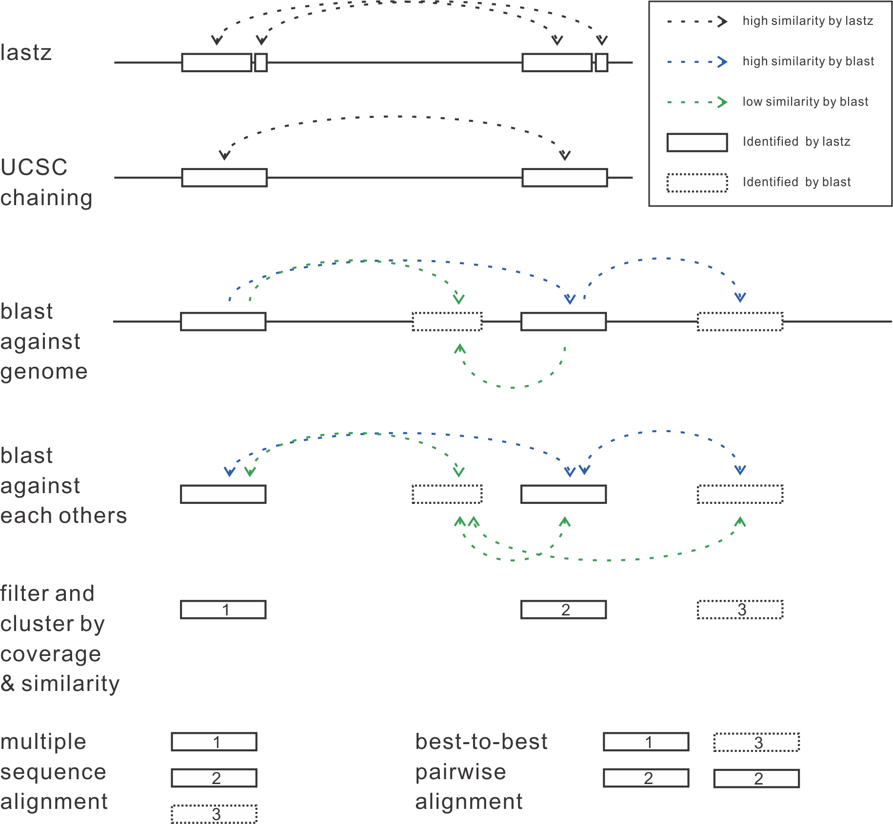

# Backend of Easy Genome Aligner

Caution: Parts of UCSC's pipeline don't work correctly under macOS.

## Examples

* Procedures of full UCSC multiple genome alignments.
    * [Two *S. cerevisiae* strains](doc/Scer-example.md)
* Procedures of whole genome self alignments for finding segment duplications (and partial WGD).
    * [*S. cerevisiae* reference strain S288c](doc/S288c-example.md)
    * [*A. thaliana*](doc/Atha.md)

## Workflows

* Workflow of multiply alignments

* Workflow of self alignments

